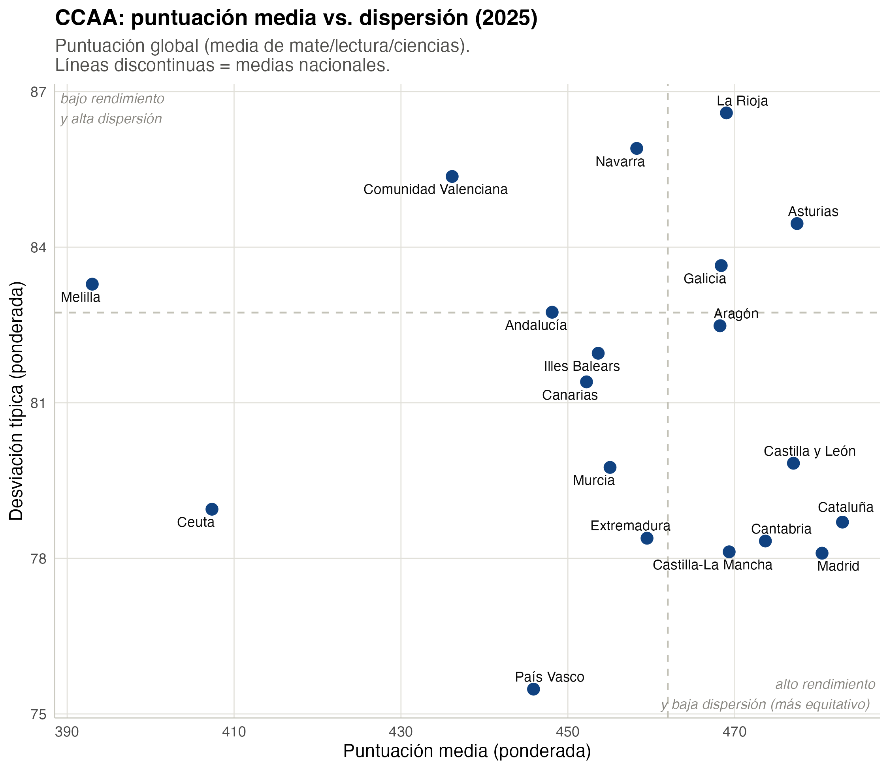
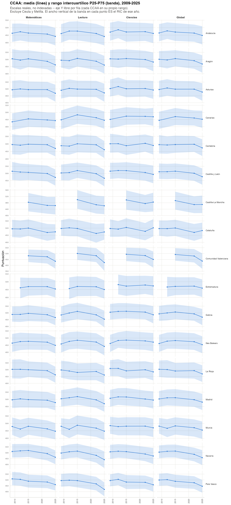
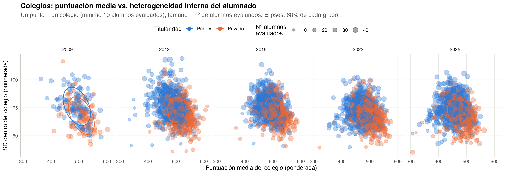
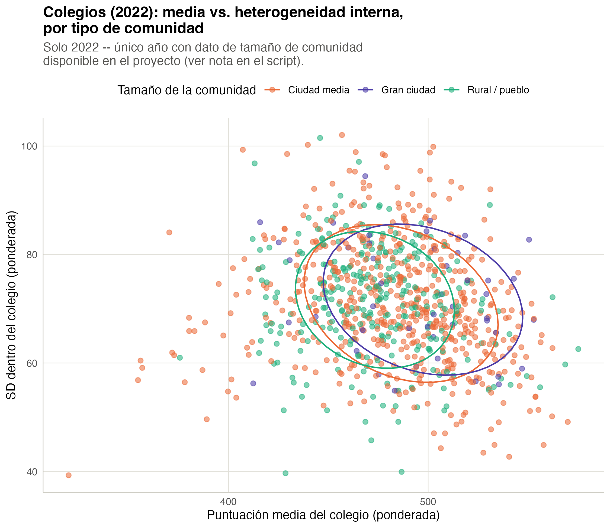

# Dispersión de resultados: no solo medias

```{r}
#| label: setup-dispersion
#| echo: false
#| message: false
library(dplyr)
library(tidyr)
library(gt)
library(scales)

disp_nacional <- readRDS("../data/tbl_dispersion_nacional.rds")
disp_nacional_sector <- readRDS("../data/tbl_dispersion_nacional_sector.rds")
descomp_var <- readRDS("../data/tbl_descomposicion_varianza.rds")
disp_entre_nacional <- readRDS("../data/tbl_dispersion_entre_colegios_nacional.rds")
disp_dentro_nacional <- readRDS("../data/tbl_dispersion_dentro_colegios_nacional.rds")
disp_entre_sector <- readRDS("../data/tbl_dispersion_entre_colegios_sector.rds")
disp_dentro_sector <- readRDS("../data/tbl_dispersion_dentro_colegios_sector.rds")

first_year <- min(disp_nacional$year)
last_year <- max(disp_nacional$year)

disp_math <- disp_nacional |> filter(domain == "math")
disp_math_first <- disp_math |> filter(year == first_year)
disp_math_last <- disp_math |> filter(year == last_year)

descomp_math <- descomp_var |> filter(domain == "math")
descomp_math_first <- descomp_math |> filter(year == first_year)
descomp_math_last <- descomp_math |> filter(year == last_year)

entre_math <- disp_entre_nacional |> filter(domain == "math")
dentro_math <- disp_dentro_nacional |> filter(domain == "math")
```

Las dos secciones siguientes de este libro (migración ampliada y
heterogeneidad de composición socioeconómica, capítulos 2 y 3) preguntan
qué explica la dispersión de resultados. Antes hace falta establecer un
hecho descriptivo básico: **¿cómo ha evolucionado esa dispersión en sí
misma**, de `r first_year` a `r last_year`, no solo la media? La media ya
está descrita en `pisa-espana-ccaa`; aquí se añade la otra mitad de la
foto.

Dos métricas complementarias (ver `README.md`): la **SD ponderada**
(coherente con la descomposición de varianza que se usa más abajo) y el
rango **P90-P10 ponderado** (más robusto a valores atípicos, en la misma
escala de puntos que la media). Todas las cifras están ponderadas por
`stu_wgt`; no se usan pesos replicados BRR-Fay (mismo criterio que
`pisa-espana-ccaa`).

## 1.1 Media y dispersión a nivel nacional

```{r}
#| label: tbl-dispersion-nacional
#| echo: false
#| tbl-cap: "Media y dispersión de resultados a nivel nacional, por dominio y año"
disp_nacional |>
  mutate(domain = recode(domain, math = "Matemáticas", read = "Lectura", science = "Ciencias")) |>
  arrange(domain, year) |>
  gt(groupname_col = "domain") |>
  fmt_number(columns = c(media, sd, p10, p90, p90_p10), decimals = 1) |>
  fmt_number(columns = n, decimals = 0) |>
  cols_label(year = "Año", n = "N", media = "Media", sd = "SD", p10 = "P10", p90 = "P90", p90_p10 = "P90-P10")
```

En matemáticas, como referencia (los otros dos dominios se mueven de forma
parecida): la SD pasa de
**`r round(disp_math_first$sd, 1)`** puntos en `r first_year` a
**`r round(disp_math_last$sd, 1)`** en `r last_year`, y el P90-P10 de
**`r round(disp_math_first$p90_p10, 1)`** a
**`r round(disp_math_last$p90_p10, 1)`**. Es decir: **la dispersión de
resultados ha bajado, de forma bastante consistente, en el mismo periodo
en que ha bajado la media** (la caída de la media 2022-2025 en particular
ya es conocida de `pisa-espana-ccaa`). No hay, a nivel nacional, una
historia de "la media baja pero la desigualdad de resultados sube" -- las
dos cosas bajan juntas. Esto no dice nada todavía sobre POR QUÉ baja la
dispersión (esa es la pregunta de los capítulos 2 y 3); aquí solo se deja
establecido que baja.

## 1.2 ¿De dónde viene la dispersión? Entre colegios vs. dentro de cada colegio

La ley de la varianza total permite separar cuánta dispersión de
resultados es **entre colegios** (unos colegios rinden mejor que otros de
media) y cuánta es **dentro de cada colegio** (alumnado de un mismo
centro con resultados muy distintos entre sí) -- un complemento puramente
descriptivo al VPC de los modelos jerárquicos de `pisa-espana-ccaa`, no
un sustituto.

```{r}
#| label: tbl-descomposicion-varianza
#| echo: false
#| tbl-cap: "Descomposición de varianza de resultados: % que es entre-colegios, por dominio y año"
descomp_var |>
  mutate(domain = recode(domain, math = "Matemáticas", read = "Lectura", science = "Ciencias")) |>
  arrange(domain, year) |>
  select(domain, year, pct_entre_colegios) |>
  gt(groupname_col = "domain") |>
  fmt_percent(columns = pct_entre_colegios, decimals = 1, scale_values = FALSE) |>
  cols_label(year = "Año", pct_entre_colegios = "% varianza entre-colegios")
```

En matemáticas, el porcentaje de la varianza que es entre-colegios pasa de
**`r round(descomp_math_first$pct_entre_colegios, 1)`%** en
`r first_year` a **`r round(descomp_math_last$pct_entre_colegios, 1)`%**
en `r last_year` (con un mínimo notable en 2015, del
`r round((descomp_math |> filter(year == 2015))$pct_entre_colegios, 1)`%).
La lectura no es monótona año a año, pero la tendencia de fondo es de
ligero descenso: España no se mueve hacia una red escolar más segregada
en resultados, más bien lo contrario.

Separando de dónde viene la caída de dispersión nacional (sección 1.1):

```{r}
#| label: tbl-entre-dentro-nacional
#| echo: false
#| tbl-cap: "SD entre-colegios y SD dentro-colegio (media), nacional, por dominio y año"
disp_entre_nacional |>
  select(year, domain, n_colegios, sd_entre) |>
  left_join(disp_dentro_nacional |> select(year, domain, sd_dentro_media), by = c("year", "domain")) |>
  mutate(domain = recode(domain, math = "Matemáticas", read = "Lectura", science = "Ciencias")) |>
  arrange(domain, year) |>
  gt(groupname_col = "domain") |>
  fmt_number(columns = c(sd_entre, sd_dentro_media), decimals = 1) |>
  fmt_number(columns = n_colegios, decimals = 0) |>
  cols_label(year = "Año", n_colegios = "Nº colegios", sd_entre = "SD entre-colegios", sd_dentro_media = "SD dentro-colegio (media)")
```

En matemáticas, la SD entre-colegios baja de
**`r round(entre_math$sd_entre[entre_math$year == first_year], 1)`** a
**`r round(entre_math$sd_entre[entre_math$year == last_year], 1)`**, y la
SD dentro-colegio de
**`r round(dentro_math$sd_dentro_media[dentro_math$year == first_year], 1)`**
a **`r round(dentro_math$sd_dentro_media[dentro_math$year == last_year], 1)`**.
**Las dos bajan**, pero la caída dentro-colegio es la que domina en
términos absolutos (es, con diferencia, el componente más grande de la
varianza total en todos los años -- en torno al 75-85% de ella, coherente
con el ~15-23% "entre-colegios" de la tabla anterior). Dicho de otro modo:
la mayor parte de por qué ha bajado la dispersión de resultados en España
es que el alumnado DENTRO de un mismo colegio se ha ido pareciendo más
entre sí en su rendimiento, no que los colegios se hayan igualado más
entre ellos (aunque esto último también ha ocurrido, en menor medida).

## 1.3 Por titularidad: los colegios privados, sistemáticamente menos dispersos por dentro

```{r}
#| label: tbl-dentro-sector
#| echo: false
#| tbl-cap: "SD dentro-colegio (media), por sector y dominio -- 2009 con cobertura de sector muy limitada (ver aviso)"
disp_dentro_sector |>
  mutate(domain = recode(domain, math = "Matemáticas", read = "Lectura", science = "Ciencias"),
         public_private = recode(public_private, publico = "Público", privado = "Privado")) |>
  arrange(domain, year, public_private) |>
  gt(groupname_col = "domain") |>
  fmt_number(columns = sd_dentro_media, decimals = 1) |>
  fmt_number(columns = n_colegios, decimals = 0) |>
  cols_label(year = "Año", public_private = "Titularidad", n_colegios = "Nº colegios", sd_dentro_media = "SD dentro-colegio (media)")
```

**Aviso de cobertura 2009**: `public_private` tiene ~76% de valores
ausentes en `r first_year` (ver `README.md`); el desglose por sector de
esa edición debe leerse con cautela extrema (base efectiva ~24% de la
muestra). 2012 en adelante es la lectura fiable.

De 2012 en adelante, el patrón es consistente en los tres dominios: los
colegios **privados** tienen, año tras año, una SD dentro del colegio más
baja que los públicos -- en matemáticas, una diferencia de entre 5 y 7
puntos en todas las ediciones desde 2012. Las dos series bajan en
paralelo (ambas reflejan la caída nacional de la sección 1.1), así que la
brecha entre sectores no se cierra ni se amplía con claridad, pero es
persistente: **el alumnado dentro de un colegio privado se parece más
entre sí, en resultados, que el alumnado dentro de un colegio público**,
en todas las ediciones fiables. Esto es coherente con lo que se ve en el
capítulo 3 sobre heterogeneidad de *composición* socioeconómica por
sector: los colegios privados también son más homogéneos por dentro en
HISEI (ver sección 3.2) -- una composición interna más homogénea es
consistente con (aunque no prueba por sí sola) una dispersión de
resultados interna también más baja.

A nivel **entre-colegios** por sector (¿los colegios públicos se parecen
más entre sí, o los privados entre sí?) el patrón es menos limpio -- no
hay una diferencia sistemática entre sectores en qué tan dispersas están
las medias de sus propios colegios entre sí; ver `data/tbl_dispersion_entre_colegios_sector.rds`
para el detalle completo por año y dominio.

## 1.4 Media vs. dispersión, en el mapa

```{r}
#| label: fig-ccaa-snapshot
#| echo: false
#| fig-cap: !expr 'paste0("CCAA: puntuación media vs. dispersión (", last_year, ")")'

```

Foto fija de `r last_year`: las CCAA en el cuadrante inferior derecho
(alto rendimiento, baja dispersión) combinan buena media con relativa
equidad interna; las del cuadrante superior izquierdo, lo contrario. Las
líneas discontinuas marcan la media y la SD nacionales.

```{r}
#| label: fig-ccaa-grid
#| echo: false
#| fig-cap: "CCAA x materia: media (línea) y rango intercuartílico P25-P75 (banda), 2009-2025"

```

La rejilla completa (17 CCAA, excluyendo Ceuta y Melilla por tamaño
muestral, x 4 materias incluida la puntuación global) permite ver
CCAA por CCAA si la banda del rango intercuartílico se estrecha o se
ensancha con el tiempo -- el ancho vertical de la banda en cada punto ES
el RIC de ese año, en la misma escala que la media (no son dos ejes
distintos, ver nota de diseño en `R/03_grafico_media_dispersion.R`).

```{r}
#| label: fig-colegio-nube
#| echo: false
#| fig-cap: "Colegios: puntuación media vs. heterogeneidad interna del alumnado, por año"

```

A nivel de colegio (un punto = un colegio, tamaño = nº de alumnos
evaluados), las elipses de público/privado (68% de cada grupo) dejan ver
lo mismo que la tabla 1.3 de forma visual: la nube de colegios privados
está sistemáticamente más a la izquierda del eje Y (menor SD interna) que
la de los públicos, año tras año.

```{r}
#| label: fig-colegio-comunidad
#| echo: false
#| fig-cap: "Colegios (2022): media vs. heterogeneidad interna, por tipo de comunidad"

```

Este último panel solo existe para 2022 -- es la única edición con
fichero de centros disponible en el proyecto (ver aviso en
`R/03_grafico_media_dispersion.R`). Con esa salvedad, no hay una
separación tan nítida por tamaño de comunidad como la que hay por
titularidad: rural/ciudad media/gran ciudad se solapan bastante más entre
sí que público/privado.
