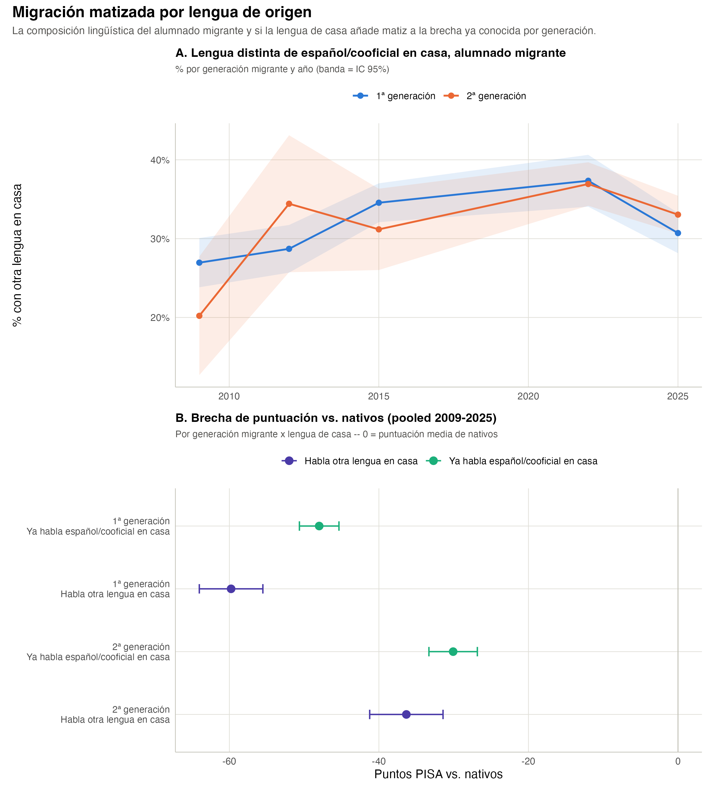

# Migración ampliada: el papel de la lengua de casa

```{r}
#| label: setup-migracion-lengua
#| echo: false
#| message: false
library(dplyr)
library(tidyr)
library(gt)
library(scales)

lengua_comp_year <- readRDS("../data/tbl_lengua_composicion_year.rds")
brecha_pooled <- readRDS("../data/tbl_brecha_lengua_pooled.rds")
brecha_year <- readRDS("../data/tbl_brecha_lengua_year.rds")
celdas_lengua <- readRDS("../data/tbl_celdas_lengua_immig.rds")

first_year <- min(lengua_comp_year$year)
last_year <- max(lengua_comp_year$year)
pct_celdas_bajo <- scales::percent(mean(brecha_year$n_bajo), accuracy = 1)

ref_nativo <- brecha_pooled |> filter(grupo == "nativo / espanol_cooficial") |> pull(media)
b_p1_esp <- brecha_pooled |> filter(grupo == "primera_gen / espanol_cooficial") |> pull(brecha_vs_nativo)
b_p1_otra <- brecha_pooled |> filter(grupo == "primera_gen / otra_lengua") |> pull(brecha_vs_nativo)
b_p2_esp <- brecha_pooled |> filter(grupo == "segunda_gen / espanol_cooficial") |> pull(brecha_vs_nativo)
b_p2_otra <- brecha_pooled |> filter(grupo == "segunda_gen / otra_lengua") |> pull(brecha_vs_nativo)
```

El estatus migratorio simple (nativo / 2ª generación / 1ª generación),
usado en `pisa-espana-ccaa`, agrupa junto a alumnado con orígenes muy
distintos. Este capítulo lo matiza con la lengua que se habla en casa --
español/cooficial (euskera, catalán, gallego, valenciano, aranés) frente
a otra lengua -- extraída de `LANGN` (ver `README.md` para la
categorización y sus límites; disponible sin huecos en las 5 ediciones,
`r first_year`-`r last_year`).

Dos preguntas: (1) ¿cómo ha cambiado la composición lingüística del
alumnado migrante con el tiempo? y (2) dentro de cada generación
migrante, ¿hablar otra lengua en casa añade una penalización de
puntuación más allá de la que ya se conoce por generación, o la
generación ya lo explica todo?

## 2.1 Composición lingüística del alumnado migrante

```{r}
#| label: tbl-lengua-composicion
#| echo: false
#| tbl-cap: "% del alumnado migrante que habla en casa una lengua distinta de español/cooficial, por generación y año"
lengua_comp_year |>
  mutate(immig = recode(immig, primera_gen = "1ª generación", segunda_gen = "2ª generación")) |>
  arrange(immig, year) |>
  transmute(immig, year, prop = prop * 100, ci_low = ci_low * 100, ci_high = ci_high * 100, n) |>
  gt(groupname_col = "immig") |>
  fmt_number(columns = c(prop, ci_low, ci_high), decimals = 1) |>
  fmt_number(columns = n, decimals = 0) |>
  cols_label(year = "Año", prop = "% otra lengua", ci_low = "IC95% inf.", ci_high = "IC95% sup.")
```

```{r}
#| label: fig-lengua-migracion
#| echo: false
#| fig-cap: "Migración matizada por lengua de origen: composición lingüística y brecha por generación x lengua"

```

El porcentaje que habla otra lengua en casa sube en ambas generaciones
desde `r first_year` hasta 2022 (1ª generación: del
`r round((lengua_comp_year |> filter(immig=="primera_gen", year==first_year))$prop*100,0)`%
al `r round((lengua_comp_year |> filter(immig=="primera_gen", year==2022))$prop*100,0)`%;
2ª generación: del
`r round((lengua_comp_year |> filter(immig=="segunda_gen", year==first_year))$prop*100,0)`%
al `r round((lengua_comp_year |> filter(immig=="segunda_gen", year==2022))$prop*100,0)`%),
con un descenso en `r last_year` en ambos casos. Un matiz que no encaja
con una historia simple de "asimilación lingüística intergeneracional":
si la 2ª generación (nacida en España) fuera dejando progresivamente el
idioma de origen en casa, cabría esperar un % de otra lengua
sistemáticamente MENOR que en 1ª generación -- en cambio, desde 2012 las
dos generaciones tienen porcentajes muy parecidos (e incluso la 2ª
generación por encima en 2012 y 2025). Este dato por sí solo no permite
concluir nada sobre asimilación -- puede reflejar simplemente que la
composición de países de origen del alumnado migrante ha ido cambiando de
edición a edición -- pero sí descarta la lectura más ingenua de "cuanto
más tiempo lleva la familia en España, menos se habla la lengua de
origen en casa".

## 2.2 ¿Añade matiz la lengua de casa a la brecha por generación?

```{r}
#| label: tbl-brecha-lengua-pooled
#| echo: false
#| tbl-cap: "Puntuación media (pooled 2009-2025) por generación x lengua de casa, y brecha vs. nativos"
brecha_pooled |>
  mutate(
    immig_lab = recode(immig, nativo = "Nativo", primera_gen = "1ª generación", segunda_gen = "2ª generación"),
    lengua_lab = recode(lengua_2cat, espanol_cooficial = "Español/cooficial en casa", otra_lengua = "Otra lengua en casa")
  ) |>
  arrange(desc(immig_lab == "Nativo"), immig_lab, lengua_lab) |>
  transmute(immig_lab, lengua_lab, media = round(media, 1),
            ic = paste0(round(ci_low, 1), " – ", round(ci_high, 1)),
            brecha_vs_nativo = round(brecha_vs_nativo, 1), n) |>
  gt() |>
  cols_label(immig_lab = "Generación", lengua_lab = "Lengua de casa", media = "Media", ic = "IC 95%",
             brecha_vs_nativo = "Brecha vs. nativos", n = "N")
```

Tomando como referencia la media de TODOS los nativos
(**`r round(ref_nativo, 1)`** puntos, sin desglosar por lengua de casa --
necesario para que la brecha sea un único número comparable, no una por
cada fila, ver nota de depuración de un bug real en
`R/07_migracion_lengua.R`), la respuesta es clara en las dos
generaciones: **hablar otra lengua en casa añade una penalización
adicional**, más allá de la ya conocida por generación migrante:

- 1ª generación: **`r round(b_p1_esp, 1)`** puntos si ya habla
  español/cooficial en casa, frente a **`r round(b_p1_otra, 1)`** si
  habla otra lengua -- una penalización adicional de
  **`r round(b_p1_otra - b_p1_esp, 1)`** puntos.
- 2ª generación: **`r round(b_p2_esp, 1)`** puntos si ya habla
  español/cooficial en casa, frente a **`r round(b_p2_otra, 1)`** si
  habla otra lengua -- una penalización adicional de
  **`r round(b_p2_otra - b_p2_esp, 1)`** puntos.

Es decir: la generación migrante NO agota la brecha. La lengua de casa
añade un matiz real -- mayor en 1ª generación (~12 puntos adicionales)
que en 2ª (~6 puntos), lo que en sí mismo es coherente con que la 2ª
generación, nacida en España, tiene en promedio más exposición al
entorno educativo en español/cooficial incluso cuando en casa se hable
otra lengua. (El grupo "nativo que habla otra lengua en casa", N=1279,
es pequeño y probablemente heterogéneo -- familias de origen extranjero
ya naturalizadas, hijos de expatriados, parejas mixtas -- no se
interpreta aquí más allá de la cifra bruta.)

```{r}
#| label: tbl-celdas-lengua
#| echo: false
#| tbl-cap: "Tamaño de celda (año x generación x lengua de casa, 3 categorías), para valorar la fiabilidad del desglose anual"
celdas_lengua |>
  mutate(immig = recode(immig, primera_gen = "1ª generación", segunda_gen = "2ª generación"),
         lengua_hogar_3cat = recode(lengua_hogar_3cat, espanol = "Español", cooficial = "Cooficial", otra_lengua = "Otra lengua")) |>
  pivot_wider(id_cols = c(immig, year), names_from = lengua_hogar_3cat, values_from = n) |>
  arrange(immig, year) |>
  gt(groupname_col = "immig") |>
  cols_label(year = "Año")
```

A esta resolución de 3 categorías, "cooficial" por separado tiene celdas
pequeñas todos los años (7-52 alumnos), sobre todo en 2ª generación --
por eso el análisis de brecha (tabla anterior) colapsa cooficial dentro
de "español/cooficial" en vez de tratarlo aparte. Con esa agrupación a 2
categorías, el desglose por año (`data/tbl_brecha_lengua_year.rds`) no
tiene ninguna celda por debajo del umbral de 30 (`r pct_celdas_bajo`), así
que la comparación pooled de la tabla anterior y el desglose anual son
igual de fiables en términos de tamaño muestral.
