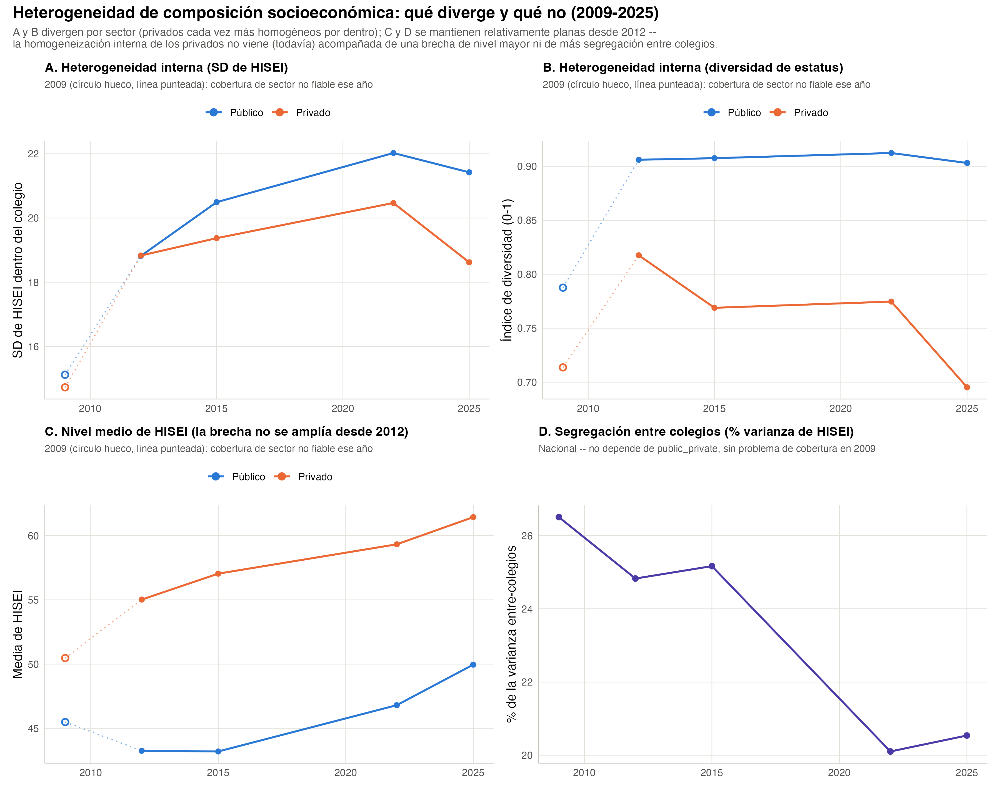
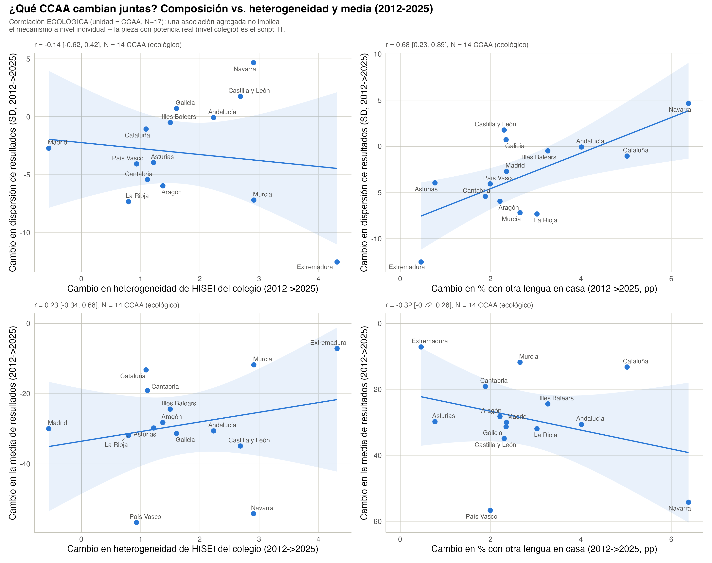
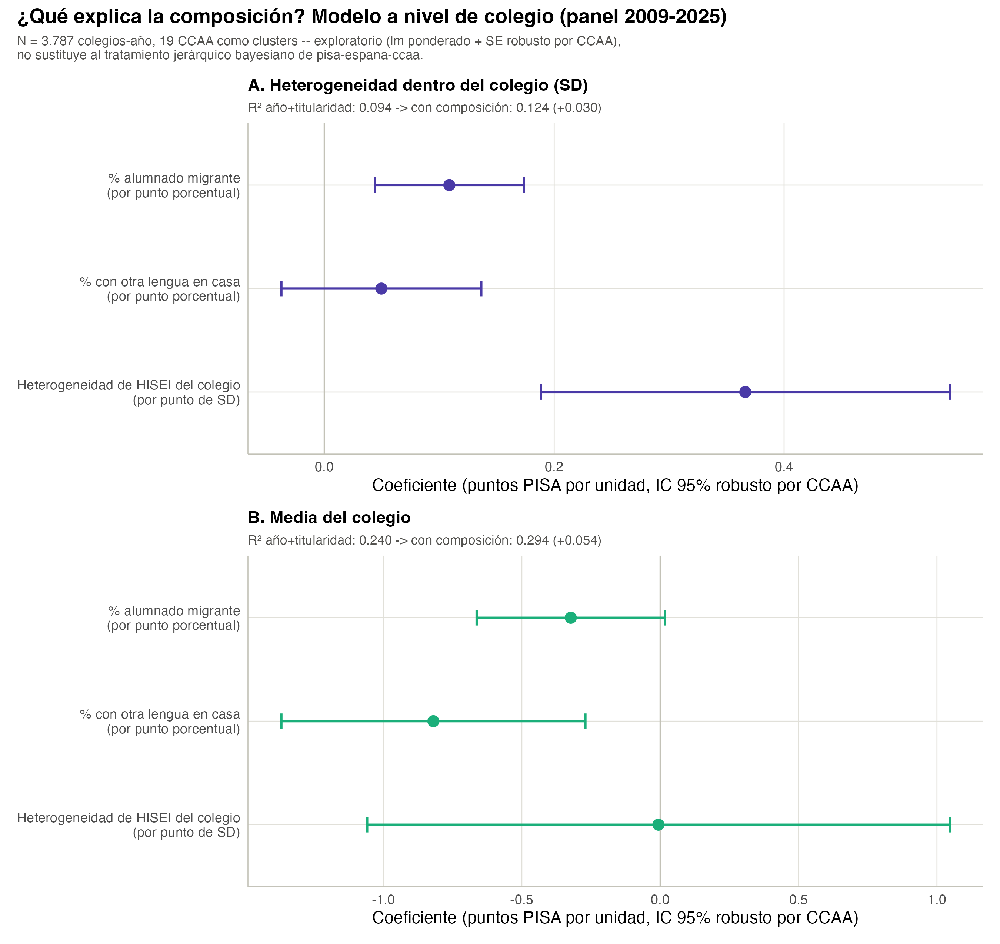

# Heterogeneidad de la composición socioeconómica del colegio

```{r}
#| label: setup-heterogeneidad-composicion
#| echo: false
#| message: false
library(dplyr)
library(tidyr)
library(gt)
library(scales)

comp_nacional <- readRDS("../data/tbl_composicion_nacional.rds")
comp_sector <- readRDS("../data/tbl_composicion_sector.rds")
comp_referencia <- readRDS("../data/tbl_composicion_nacional_referencia.rds")
descomp_hisei <- readRDS("../data/tbl_descomposicion_hisei.rds")
brecha_hisei_sector <- readRDS("../data/tbl_brecha_hisei_sector.rds")
correlaciones_eco <- readRDS("../data/tbl_correlaciones_ecologicas_ccaa.rds")
cambios_ccaa <- readRDS("../data/tbl_cambios_ccaa_2012_2025.rds")
regresion_colegio <- readRDS("../data/tbl_regresion_colegio_heterogeneidad.rds")
colegio_completo <- tryCatch(readRDS("../data/tbl_colegio_completo_heterogeneidad.rds"), error = function(e) NULL)

first_year <- min(comp_nacional$year)
last_year <- max(comp_nacional$year)

hisei_sd_first <- comp_nacional |> filter(year == first_year) |> pull(hisei_sd_media)
hisei_sd_last <- comp_nacional |> filter(year == last_year) |> pull(hisei_sd_media)
hisei_sd_peak_year <- comp_nacional |> filter(hisei_sd_media == max(hisei_sd_media)) |> pull(year)

descomp_hisei_first <- descomp_hisei |> filter(year == first_year) |> pull(pct_entre_colegios)
descomp_hisei_last <- descomp_hisei |> filter(year == last_year) |> pull(pct_entre_colegios)

r_lengua_sd <- correlaciones_eco |> filter(x_var == "delta_pct_otra_lengua", y_var == "delta_sd")
n_ccaa_eco <- unique(correlaciones_eco$n)

sd_hisei_coef <- regresion_colegio |> filter(y == "sd_dentro (heterogeneidad)", term == "hisei_sd")
media_hisei_coef <- regresion_colegio |> filter(y == "media_colegio (nivel)", term == "hisei_sd")
media_lengua_coef <- regresion_colegio |> filter(y == "media_colegio (nivel)", term == "pct_otra_lengua")
r2_sd_base <- unique((regresion_colegio |> filter(y == "sd_dentro (heterogeneidad)"))$r2_base)
r2_sd_completo <- unique((regresion_colegio |> filter(y == "sd_dentro (heterogeneidad)"))$r2_completo)
r2_media_base <- unique((regresion_colegio |> filter(y == "media_colegio (nivel)"))$r2_base)
r2_media_completo <- unique((regresion_colegio |> filter(y == "media_colegio (nivel)"))$r2_completo)
n_colegio_anio <- if (!is.null(colegio_completo)) nrow(colegio_completo) else NA_integer_
n_ccaa_regresion <- unique(regresion_colegio$n_clusters)
```

La pregunta de Julián que organiza este capítulo (2026-09-26): la
heterogeneidad y la media de resultados han evolucionado en las distintas
CCAA y colegios -- **¿en qué medida lo explican la migración/lengua
(capítulo 2), u otros elementos de composición socioeconómica del
colegio?** Se aborda en tres piezas de potencia creciente: heterogeneidad
de composición en sí misma (04-05), su correlación ECOLÓGICA a nivel de
CCAA (09-10, N~14-17) y, con la potencia real, su relación a nivel de
COLEGIO (11-12, miles de observaciones). Una cuarta pieza -- el
tratamiento jerárquico bayesiano riguroso (INLA) -- está en
`pisa-espana-ccaa/R/09_modelo_covariables_colegio.R`, no aquí; este
capítulo cierra comparando sus conclusiones con las de ese modelo.

## 3.1 Heterogeneidad de composición: no solo el nivel medio de HISEI

Dos métricas por colegio (mismo espíritu que la dispersión de resultados
del capítulo 1, aplicado ahora a la composición socioeconómica de
entrada, no al resultado de salida): la **SD ponderada de HISEI** dentro
del colegio, y un **índice de diversidad** de estatus laboral (entropía
de Shannon normalizada a [0,1]; 0 = todo el alumnado en una sola
categoría, 1 = tercio/tercio/tercio).

```{r}
#| label: tbl-composicion-nacional
#| echo: false
#| tbl-cap: "Heterogeneidad de composición socioeconómica del colegio, nacional, por año"
comp_nacional |>
  gt() |>
  fmt_number(columns = c(hisei_sd_media, diversidad_media), decimals = 2) |>
  fmt_number(columns = n_colegios, decimals = 0) |>
  cols_label(year = "Año", n_colegios = "Nº colegios", hisei_sd_media = "SD de HISEI (media)", diversidad_media = "Diversidad de estatus (media)")
```

A diferencia de la dispersión de RESULTADOS (que baja, capítulo 1), la
heterogeneidad de COMPOSICIÓN sube: la SD de HISEI dentro del colegio
pasa de **`r round(hisei_sd_first, 1)`** en `r first_year` a
**`r round(hisei_sd_last, 1)`** en `r last_year`, con un máximo en
`r hisei_sd_peak_year`. Los colegios mezclan hoy más alumnado de distinto
origen socioeconómico que en `r first_year` -- justo lo contrario de lo
que ha pasado con la dispersión de notas. Esta divergencia entre las dos
tendencias es la que motiva mirar si están relacionadas (secciones 3.2 y
3.3): si la composición socioeconómica es cada vez más heterogénea
mientras los resultados son cada vez menos dispersos, a priori no es la
explicadora principal de la caída de dispersión de resultados -- se
comprueba con potencia real en la sección 3.3.

El índice de diversidad de estatus laboral solo puede leerse junto a su
techo teórico -- si la población nacional ya está desequilibrada entre
baja/media/alta, ningún colegio puede alcanzar diversidad = 1 aunque
mezcle perfectamente el alumnado disponible:

```{r}
#| label: tbl-composicion-referencia
#| echo: false
#| tbl-cap: "Composición nacional de referencia (%) y techo teórico de diversidad, por año"
comp_referencia |>
  gt() |>
  fmt_number(columns = c(pct_baja, pct_media, pct_alta), decimals = 1) |>
  fmt_number(columns = diversidad_techo, decimals = 3) |>
  cols_label(year = "Año", pct_baja = "% baja", pct_media = "% media", pct_alta = "% alta", diversidad_techo = "Techo de diversidad")
```

`r first_year` es un caso aparte (población nacional muy desequilibrada
hacia "media", techo de solo
`r round((comp_referencia |> filter(year==first_year))$diversidad_techo, 2)`);
desde 2012 el techo está siempre por encima de 0,93, así que la
diversidad media por colegio (tabla anterior, en torno a 0,83-0,87 desde
2012) está bastante cerca de su máximo alcanzable -- los colegios, en
conjunto, mezclan casi tanto como la composición nacional permite.

## 3.2 Por sector: los colegios privados, cada vez más homogéneos por dentro

```{r}
#| label: fig-composicion-sector
#| echo: false
#| fig-cap: "Heterogeneidad de composición socioeconómica: qué diverge y qué no (2009-2025)"

```

**Aviso 2009**: igual que en el capítulo 1, el ~24% de la muestra de
`r first_year` con `public_private` informado no es representativo (reparto
~50/50 frente al ~67/33 real desde 2012) -- lectura fiable desde 2012.

Cuatro hechos, leídos juntos, resuelven una aparente contradicción
discutida con Julián el 2026-09-26 (ver nota en
`R/04_heterogeneidad_composicion_colegio.R`): que un sector se vuelva más
homogéneo por dentro NO implica automáticamente que la brecha de nivel
entre sectores suba, ni que la segregación entre colegios aumente --
son tres cosas distintas, que pueden moverse de forma independiente:

```{r}
#| label: tbl-composicion-sector
#| echo: false
#| tbl-cap: "Heterogeneidad de composición por sector, desde 2012 (año fiable)"
comp_sector |>
  filter(year >= 2012) |>
  mutate(public_private = recode(public_private, publico = "Público", privado = "Privado")) |>
  arrange(year, public_private) |>
  gt(groupname_col = "year") |>
  fmt_number(columns = c(hisei_sd_media, diversidad_media), decimals = 2) |>
  fmt_number(columns = n_colegios, decimals = 0) |>
  cols_label(public_private = "Titularidad", n_colegios = "Nº colegios", hisei_sd_media = "SD de HISEI", diversidad_media = "Diversidad de estatus")
```

**A y B divergen**: los públicos mantienen una diversidad interna alta y
estable (en torno a 0,90-0,91 desde 2012); los privados **bajan**, de
0,82 (2012) a 0,70 (`r last_year`) -- se han vuelto notablemente más
homogéneos por dentro, sobre todo en la última edición. En SD de HISEI
pasa algo parecido: la brecha público-privado, casi inexistente en 2012
(18,8 vs. 18,8), se abre hasta 21,4 vs. 18,6 en `r last_year` -- los
públicos ahora mezclan más HISEI internamente que los privados, cuando en
2012 eran prácticamente iguales.

```{r}
#| label: tbl-brecha-hisei-sector
#| echo: false
#| tbl-cap: "Brecha de NIVEL medio de HISEI, privado menos público, por año (usar 2012+ como fiable)"
brecha_hisei_sector |>
  gt() |>
  fmt_number(columns = c(publico, privado, brecha_privado_publico), decimals = 1) |>
  cols_label(year = "Año", publico = "Público", privado = "Privado", brecha_privado_publico = "Brecha (privado - público)")
```

**C: la brecha de NIVEL no se amplía desde 2012** -- pasa de
**`r round((brecha_hisei_sector |> filter(year==2012))$brecha_privado_publico, 1)`**
a **`r round((brecha_hisei_sector |> filter(year==last_year))$brecha_privado_publico, 1)`**
puntos de HISEI, sin tendencia clara (sube y baja entre ediciones, sin
ampliarse de forma sostenida).

```{r}
#| label: tbl-descomposicion-hisei
#| echo: false
#| tbl-cap: "% de la varianza de HISEI que es entre-colegios (segregación socioeconómica de la red), nacional"
descomp_hisei |>
  select(year, pct_entre_colegios) |>
  gt() |>
  fmt_number(columns = pct_entre_colegios, decimals = 1) |>
  cols_label(year = "Año", pct_entre_colegios = "% varianza entre-colegios")
```

**D: la segregación ENTRE colegios por HISEI tampoco sube** -- de
**`r round(descomp_hisei_first, 1)`%** en `r first_year` a
**`r round(descomp_hisei_last, 1)`%** en `r last_year`, con un descenso
neto. En conjunto: **la homogeneización interna de los colegios
privados NO viene (todavía) acompañada de una brecha de nivel mayor
entre sectores ni de más segregación socioeconómica entre colegios a
nivel nacional** -- es un cambio real, pero contenido dentro del propio
sector privado, no un síntoma de una red escolar cada vez más partida en
dos.

## 3.3 ¿Explica la composición la dispersión y la media de resultados?

### Correlación ecológica por CCAA (N pequeño, orientativa)

Primera aproximación, a nivel de CCAA (`r n_ccaa_eco` CCAA con dato
completo en 2012 y 2025 -- de 17, excluyendo Ceuta/Melilla; el resto
faltan en alguno de los dos años, ver aviso en
`R/10_correlacion_ecologica_heterogeneidad.R`): de las CCAA donde MÁS ha
subido la heterogeneidad de composición, ¿son las mismas donde MÁS ha
cambiado la dispersión o la media de resultados?

```{r}
#| label: fig-correlacion-ecologica
#| echo: false
#| fig-cap: "¿Qué CCAA cambian juntas? Composición vs. heterogeneidad y media (2012-2025)"

```

```{r}
#| label: tbl-correlacion-ecologica
#| echo: false
#| tbl-cap: "Correlaciones ecológicas de cambio 2012-2025, por CCAA (N=14, ecológico -- no implica nivel individual)"
correlaciones_eco |>
  transmute(x_label, y_label, r = round(r, 2), ic = paste0(round(ci_low, 2), " – ", round(ci_high, 2)), p_value = round(p_value, 3)) |>
  gt() |>
  cols_label(x_label = "Predictor (cambio)", y_label = "Desenlace (cambio)", ic = "IC 95%", p_value = "p")
```

De las 6 correlaciones (3 predictores x 2 desenlaces), solo una alcanza
significación con este N tan pequeño: el cambio en **% con otra lengua en
casa** correlaciona con el cambio en **dispersión de resultados** (r =
**`r round(r_lengua_sd$r, 2)`**, IC95%
[`r round(r_lengua_sd$ci_low,2)`, `r round(r_lengua_sd$ci_high,2)`], p =
`r round(r_lengua_sd$p_value, 3)`) -- las CCAA donde más ha crecido la
mezcla lingüística son las que menos ha bajado (o más ha subido) su
dispersión de resultados. Es una correlación ECOLÓGICA (unidad = CCAA,
N=14): no implica que sea el alumnado con otra lengua en casa el que
individualmente explica esa dispersión -- solo que ambas cosas se mueven
juntas a nivel agregado. Las otras cinco correlaciones (incluida
heterogeneidad de HISEI vs. dispersión, y las tres frente a la media) no
son distinguibles de cero con este tamaño de muestra.

### A nivel de colegio: la pieza con potencia real

```{r}
#| label: fig-regresion-colegio
#| echo: false
#| fig-cap: "¿Qué explica la composición? Modelo a nivel de colegio (panel 2009-2025)"

```

Con `r format(n_colegio_anio, big.mark=".", decimal.mark=",")` colegios-año
(las 5 ediciones agrupadas, `r n_ccaa_regresion` CCAA como clusters para
el error robusto -- ver aviso sobre grados de libertad aproximados en
`R/11_regresion_colegio_heterogeneidad.R`) la potencia es muy superior a
la correlación ecológica anterior. Dos modelos `lm()` ponderados
anidados (año + titularidad, frente a + composición), un desenlace cada
uno:

```{r}
#| label: tbl-regresion-colegio
#| echo: false
#| tbl-cap: "Coeficientes de composición (IC 95% robusto por CCAA), sobre heterogeneidad dentro del colegio y sobre su media"
regresion_colegio |>
  mutate(
    y = recode(y, "sd_dentro (heterogeneidad)" = "Heterogeneidad dentro del colegio (SD)", "media_colegio (nivel)" = "Media del colegio"),
    term = recode(term, pct_migrante = "% alumnado migrante", pct_otra_lengua = "% otra lengua en casa", hisei_sd = "Heterogeneidad de HISEI")
  ) |>
  select(y, term, estimate, ci_low, ci_high) |>
  gt(groupname_col = "y") |>
  fmt_number(columns = c(estimate, ci_low, ci_high), decimals = 3) |>
  cols_label(term = "Variable", estimate = "Coeficiente", ci_low = "IC95% inf.", ci_high = "IC95% sup.")
```

**Heterogeneidad dentro del colegio** (R² año+titularidad:
`r round(r2_sd_base,3)` -> con composición: `r round(r2_sd_completo,3)`,
+`r round(r2_sd_completo - r2_sd_base, 3)`): la heterogeneidad de HISEI
del colegio es, con diferencia, el predictor más fuerte y más preciso
(**`r round(sd_hisei_coef$estimate,3)`**, IC95%
[`r round(sd_hisei_coef$ci_low,3)`, `r round(sd_hisei_coef$ci_high,3)`]
puntos PISA de SD interna por cada punto de SD de HISEI) -- coherente con
lo esperable de forma casi mecánica: un colegio que mezcla alumnado de
distinto origen socioeconómico también mezcla, en parte, alumnado de
distinto rendimiento. El % de alumnado migrante también es significativo,
aunque con un coeficiente mucho menor; el % de otra lengua en casa no lo
es en este modelo (a diferencia de la correlación ecológica de la
sección anterior -- con potencia real, no sobrevive).

**Media del colegio** (R² año+titularidad: `r round(r2_media_base,3)` ->
con composición: `r round(r2_media_completo,3)`,
+`r round(r2_media_completo - r2_media_base, 3)`): aquí el patrón se
**invierte**. El % de otra lengua en casa sí predice la media (negativo,
**`r round(media_lengua_coef$estimate, 3)`**, IC95%
[`r round(media_lengua_coef$ci_low,3)`, `r round(media_lengua_coef$ci_high,3)`]
puntos PISA por punto porcentual) -- un colegio con más mezcla
lingüística tiende a una media algo más baja, más allá de año y
titularidad. Pero la **heterogeneidad de HISEI no predice la media en
absoluto**: el coeficiente es
**`r round(media_hisei_coef$estimate,3)`**, con un intervalo
[`r round(media_hisei_coef$ci_low,3)`, `r round(media_hisei_coef$ci_high,3)`]
que cruza ampliamente el cero.

### Un mismo hallazgo, por dos caminos independientes

Este último resultado -- heterogeneidad de HISEI con un efecto fuerte y
preciso sobre la DISPERSIÓN dentro del colegio, pero nulo sobre su MEDIA
-- **es exactamente lo que encuentra, por un método completamente
distinto, el modelo jerárquico bayesiano (INLA) de
`pisa-espana-ccaa/R/09_modelo_covariables_colegio.R`**: ahí, controlando
migración y titularidad en un modelo multinivel con toda la muestra de
2022, el coeficiente de `hisei_sd_c` sobre la puntuación media tampoco es
distinguible de cero en ningún dominio, pese a que el VPC de colegio baja
al añadirlo. Dos métodos independientes -- un `lm()` ponderado sobre el
panel completo 2009-2025 aquí, un modelo jerárquico bayesiano de un solo
año allí -- llegan a la misma conclusión: **la heterogeneidad
socioeconómica de un colegio se traduce en heterogeneidad de resultados
dentro de ese colegio, no en que ese colegio rinda mejor o peor de
media**. Es la explicación más sólida, con dos fuentes independientes,
que tiene este proyecto para el porqué de la evolución de la dispersión
de resultados: no es la composición migrante ni la heterogeneidad
socioeconómica quien más explica que la dispersión de resultados haya
bajado a nivel nacional (capítulo 1) -- si acaso, la heterogeneidad de
composición ha ido en la dirección contraria (sección 3.1) -- sino que,
DENTRO de cada colegio, un alumnado de origen socioeconómico más
mezclado se traduce, de forma consistente, en resultados también más
mezclados.
